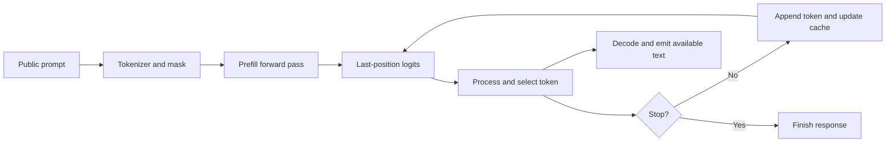

# Module 1: Inference request lifecycle

Status: Not started. Last verified: 2026-09-30. Estimated time: **7 hours**,
including selected reading, experiments, code reading, review and catch-up.
Shared experiments are charged once in the schedule.

[Curriculum](../CURRICULUM.md) ·
[Source pack](../notebooklm/source-packs/01-inference-request-lifecycle.md) ·
[Evidence](../EVIDENCE.md) · [Schedule](../SCHEDULE.md)

## Purpose and relevance to inference engineering

Trace text through configuration, weights, tokenization, placement, forward pass
and streamed output. This connects an observable request behavior to the
implementation boundary responsible for it, so an optimization can be tested.

## Prerequisites

Pass the Phase 1 evidence gate: shapes, autograd, attention, dtype and memory
reasoning.

## Learning objectives

- Trace text through configuration, weights, tokenization, placement, forward
  pass and streamed output.
- Identify logits processing, token selection, stop conditions and decoding.
- Separate model loading, first request and warmed execution.

## Required concepts

- Configuration
- weight formats
- weights
- tokenizer
- input IDs
- attention masks
- device placement
- forward pass
- logits
- logit processing
- sampling
- token append
- EOS and length/stop conditions
- detokenization
- streaming
- cold execution
- warm-up

## Detailed explanations and worked examples

### One request is a sequence of contracts

Configuration describes architecture; weights supply parameter values. A weight
file alone does not describe tokenization, sampling or service behavior.
Safetensors stores tensors without a pickle execution mechanism; this does not
establish the quality or trustworthiness of a model. Load a public reviewed
revision, use its matching tokenizer, avoid remote custom code, and separate
weight download from loading time. The selected Safetensors and generation
references define these interfaces.

Tokenization produces integer IDs and a mask. Device placement must put inputs
and model operations on compatible devices. A forward pass yields logits, not
text. Logit processors may constrain tokens; sampling or argmax selects an ID.
The loop appends that ID, updates state and checks EOS, length and stop rules.
Detokenization converts IDs to text; a streaming implementation may buffer
several tokens before emitting a readable chunk.

The loop arrow abbreviates another model forward pass; it does not reuse the
previous logits. In E01, annotate that missing computation explicitly. For input
IDs of shape `(1,12)` and vocabulary size `V`, an ordinary full-logit prefill
returns `(1,12,V)`. Selecting `logits[:,-1,:]` predicts token 13. Do not confuse
12 prompt tokens with 12 generated tokens.

A cold process includes imports, loading and backend initialization. A first
request can additionally pay allocator/kernel/compilation costs. A warmed run
retains some state, but request KV state must be reset unless reuse is the
tested variable. Record each boundary rather than calling every first call
"cold".

**Worked reasoning:** if model load takes `L`, tokenization `T`, first-token
computation `F`, and later generation `D`, a local cold response takes roughly
`L+T+F+D+decode overhead` . A server with a preloaded model omits `L` from
request latency but may add queuing and transport. These are symbolic
components, not measured results.

## Required and optional sources

- `p2-m1-generate` :
  [Generate text](https://huggingface.co/docs/transformers/llm_tutorial) —
  primary, required; 0.75 h. Study: Load a model; generate text; common
  pitfalls. Skip: Unlisted APIs, training/fine-tuning, distributed deployment
  and backend installation beyond the local lab.
- `p2-m1-api` :
  [Generation API](https://huggingface.co/docs/transformers/main_classes/text_generation)
  — supporting, required; 0.5 h. Study: GenerationConfig: length, sampling,
  cache, output and streamer parameters. Skip: Unlisted APIs,
  training/fine-tuning, distributed deployment and backend installation beyond
  the local lab.
- `p2-m1-format` : [Safetensors](https://huggingface.co/docs/safetensors/index)
  — supporting, required; 0.5 h. Study: Introduction; loading tensors; format
  overview. Skip: Unlisted APIs, training/fine-tuning, distributed deployment
  and backend installation beyond the local lab.
- `p2-m1-padding` :
  [Padding and truncation](https://huggingface.co/docs/transformers/main/en/pad_truncation)
  — supporting, required; 0.5 h. Study: Padding; truncation; max_length
  combinations. Skip: Unlisted APIs, training/fine-tuning, distributed
  deployment and backend installation beyond the local lab.
- `p2-m1-model` :
  [SmolLM2-135M model card](https://huggingface.co/HuggingFaceTB/SmolLM2-135M) —
  supporting, required; 0.5 h. Study: Model description; usage; limitations;
  license. Skip: Unlisted APIs, training/fine-tuning, distributed deployment and
  backend installation beyond the local lab.

The source pack records publisher, access, terms, exact sections and import
order. Prefer the official contract over overlapping generic tutorials. Reused
sources are targeted lookups, not a requirement to reread the full document.
Optional visual study: redraw the architecture/cache diagrams in these same
sources and explain every arrow; no extra repetitive source is needed.

## Study order

1. Read the primary source’s listed sections and define the module’s terms.
2. Work through the example above by hand, checking shapes, units and
   assumptions.
3. Read supporting sources in the listed order; record one clarification or
   conflict.
4. Execute the linked practical work and retain raw observations before
   analysis.
5. Read code, give a closed-source teach-back, then correct it against sources.

## Practical exercises

- [E01](../exercises/01-request-lifecycle.md)
- [E07](../exercises/07-warm-cold.md)

## Code-reading task

Read the relevant path in [the local lab](../scripts/inference_lab.py): model
loading, tokenization and token loop. Annotate inputs, outputs, ownership and
one error path. Then locate the related symbol using the source link in the
official documentation at a recorded version.

## Reflection and misconceptions

- Which statement here depends on a model, backend or workload assumption?
- What observation would falsify your current explanation?
- Which result cannot be generalized to a larger model or different hardware?
- Challenge: a smaller memory footprint always means lower latency.
- Challenge: a successful run or Audio Overview proves this module is mastered.

## Common implementation mistakes

Reusing unrecorded defaults; changing multiple workload variables; confusing
logical tokens with padded positions; measuring asynchronous enqueue time;
retaining previous request state; and treating simulated results as device data.
Identify which mistakes are relevant to your experiment and show how you
checked.

## Required evidence and exit test

- Original explanation and annotated code trace
- Reproducible experiment with raw measurements or explicit hardware limitation
- Reviewed exit assessment with corrections

Without NotebookLM, demonstrate each learning objective on a fresh example.
Explain one failed hypothesis or plausible failure and what measurement would
resolve it. Apply the [rubric](../assessments/rubric.md); explicitly admit where
supplied evidence is insufficient. Reading time alone cannot pass this gate.

## Completion checklist

- [ ] Explain each required concept at application level where exercised.
- [ ] Complete a fresh calculation/trace with stated assumptions.
- [ ] Link raw observations, environment and interpretation.
- [ ] Review the exit test; correct critical misconceptions.
- [ ] Mark hardware-dependent work pending where it was not executed.

## Connection to the next module

Continue to [Prefill, decode and KV cache](02-prefill-decode-and-kv-cache.md)
after recording the exit evidence.
