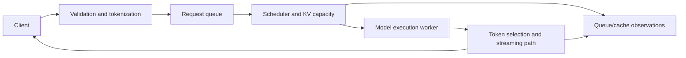

# Module 7: Serving systems and the vLLM bridge

Status: Not started. Last verified: 2026-09-30. Estimated time: **6 hours**,
including selected reading, experiments, code reading, review and catch-up.
Shared experiments are charged once in the schedule.

[Curriculum](../CURRICULUM.md) ·
[Source pack](../notebooklm/source-packs/07-serving-systems-and-vllm-bridge.md)
· [Evidence](../EVIDENCE.md) · [Schedule](../SCHEDULE.md)

## Purpose and relevance to inference engineering

Map API, scheduling, execution, cache and streaming responsibilities. This
connects an observable request behavior to the implementation boundary
responsible for it, so an optimization can be tested.

## Prerequisites

Complete the preceding module’s evidence and exit test; retain its assumptions
for comparisons.

## Learning objectives

- Map API, scheduling, execution, cache and streaming responsibilities.
- Explain PagedAttention conceptually without claiming kernel expertise.
- Prepare a code-reading and development plan for Phase 3 with evidence gaps.

## Required concepts

- API compatibility
- request handling
- tokenization
- queuing
- scheduling
- execution
- KV management
- streaming
- metrics
- health checks
- failures
- model lifecycle
- specialized engines
- vLLM architecture
- PagedAttention
- continuous batching
- scheduler and worker roles
- code navigation

## Detailed explanations and worked examples

### Specialized serving separates responsibilities

An inference server validates and receives requests, tokenizes, queues work,
schedules execution, manages request/cache state, streams results and exposes
operational signals. A model lifecycle includes loading, readiness, warm-up and
shutdown. Process liveness does not prove model readiness; readiness does not
prove capacity for every incoming request. Failure handling must cover invalid
inputs, timeouts, cancellation and partial streams.

API compatibility concerns request/response contracts, not identical
tokenization, outputs, sampling defaults or latency. Compare Transformers as a
framework, Ollama as a packaged local-serving interface, and vLLM as a
specialized serving engine at a conceptual level; only the selected Transformers
lab is required here. A fair empirical three-system comparison needs matching
model artifacts, precision and load definitions and remains later work.

In the current vLLM overview, API-server work is separated from an engine core
that schedules and manages KV state; workers execute model work. Record the
release or commit before following code because paths evolve. Continuous
batching addresses variable request lifetimes; PagedAttention supplies
block-based KV management. The paper explains the original design, while current
documentation is authoritative for today's process/API boundaries. Neither
substitutes for reading the implementation at the chosen revision.

This is a responsibility map, not an exact thread/process diagram. In a code
trace, label the actual owning component rather than forcing code to match it. A
bottleneck can move between these boundaries as prompt length and concurrency
change. A useful Phase 3 question includes the exact revision, reproduction and
expected versus observed behavior, not a request for maintainers to debug an
unbounded setup.

### Phase 3 readiness map

| Category                  | Current evidence status                                                              | Next action                                                                                                     |
| ------------------------- | ------------------------------------------------------------------------------------ | --------------------------------------------------------------------------------------------------------------- |
| Concepts already mastered | None certified by this repository                                                    | Link assessed Phase 1/2 evidence before changing this row                                                       |
| Introduced, not mastered  | Paged allocation, continuous scheduling, prefix reuse, server boundaries             | Explain examples and inspect current implementation                                                             |
| Code areas to inspect     | API entry points, V1 scheduler, KV cache manager, worker/model runner, metrics tests | Locate by symbol at a recorded commit; trace one request                                                        |
| Development setup         | Not started                                                                          | Select supported CPU/GPU development environment, read contributor guide, build and run a small test in Phase 3 |
| Community questions       | Planned                                                                              | Ask about a reproduced metric discrepancy, cancellation cleanup or bounded scheduling test with evidence        |

Use the [readiness review](../assessments/phase-3-readiness-review.md). No Phase
3 contribution, local build or community interaction is claimed here.

## Required and optional sources

- `p2-m7-arch` :
  [vLLM Architecture Overview](https://docs.vllm.ai/en/latest/design/arch_overview/)
  — primary, required; 0.75 h. Study: Process architecture; API server; engine
  core; workers and model execution. Skip: Unlisted APIs, training/fine-tuning,
  distributed deployment and backend installation beyond the local lab.
- `p2-m7-online` :
  [vLLM Online Serving](https://docs.vllm.ai/en/latest/serving/online_serving/)
  — supporting, required; 0.5 h. Study: OpenAI-compatible server; supported
  APIs; basic and metrics APIs. Skip: Unlisted APIs, training/fine-tuning,
  distributed deployment and backend installation beyond the local lab.
- `p2-m7-metrics` :
  [vLLM Production Metrics](https://docs.vllm.ai/en/latest/usage/metrics/) —
  supporting, required; 0.5 h. Study: Metrics endpoint; request latency, queue,
  token and cache metric examples. Skip: Unlisted APIs, training/fine-tuning,
  distributed deployment and backend installation beyond the local lab.
- `p2-m7-paged` :
  [Efficient Memory Management for Large Language Model Serving with PagedAttention](https://arxiv.org/html/2309.06180v1)
  — supporting, optional; 0.5 h. Study: Sections 2–4; 6.1 experiment setup;
  Figures 2–4. Skip: Distributed deployment, custom kernels and full evaluation
  reproduction; follow only the listed sections.

The source pack records publisher, access, terms, exact sections and import
order. Prefer the official contract over overlapping generic tutorials. Reused
sources are targeted lookups, not a requirement to reread the full document.
Optional visual study: redraw the architecture/cache diagrams in these same
sources and explain every arrow; no extra repetitive source is needed.

## Study order

1. Read the primary source’s listed sections and define the module’s terms.
2. Work through the example above by hand, checking shapes, units and
   assumptions.
3. Read supporting sources in the listed order; record one clarification or
   conflict.
4. Execute the linked practical work and retain raw observations before
   analysis.
5. Read code, give a closed-source teach-back, then correct it against sources.

## Practical exercises

- [E08](../exercises/08-bottleneck.md)

## Code-reading task

Read the relevant path in [the local lab](../scripts/inference_lab.py): the
generation loop; map its missing server responsibilities to the diagram.
Annotate inputs, outputs, ownership and one error path. Then locate the related
symbol using the source link in the official documentation at a recorded
version.

## Reflection and misconceptions

- Which statement here depends on a model, backend or workload assumption?
- What observation would falsify your current explanation?
- Which result cannot be generalized to a larger model or different hardware?
- Challenge: a smaller memory footprint always means lower latency.
- Challenge: a successful run or Audio Overview proves this module is mastered.

## Common implementation mistakes

Reusing unrecorded defaults; changing multiple workload variables; confusing
logical tokens with padded positions; measuring asynchronous enqueue time;
retaining previous request state; and treating simulated results as device data.
Identify which mistakes are relevant to your experiment and show how you
checked.

## Required evidence and exit test

- Original explanation and annotated code trace
- Reproducible experiment with raw measurements or explicit hardware limitation
- Reviewed exit assessment with corrections

Without NotebookLM, demonstrate each learning objective on a fresh example.
Explain one failed hypothesis or plausible failure and what measurement would
resolve it. Apply the [rubric](../assessments/rubric.md); explicitly admit where
supplied evidence is insufficient. Reading time alone cannot pass this gate.

## Completion checklist

- [ ] Explain each required concept at application level where exercised.
- [ ] Complete a fresh calculation/trace with stated assumptions.
- [ ] Link raw observations, environment and interpretation.
- [ ] Review the exit test; correct critical misconceptions.
- [ ] Mark hardware-dependent work pending where it was not executed.

## Connection to the next module

Continue to
[Phase 3 readiness review](../assessments/phase-3-readiness-review.md) after
recording the exit evidence.
